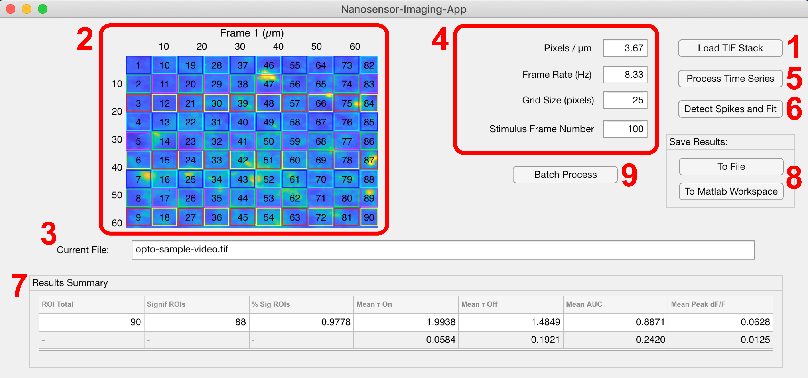

<h1 align="center">
Nanosensor-Imaging-App
 

</h1>

## Table of Contents
* [Description](#description)
* [Features](#features)
* [Installation](#installation)
* [Usage](#usage)
* [Support](#support)
* [Troubleshooting](#troubleshooting)
* [Acknowledgements](#acknowledgements)
* [License](#license)

 
## Description
The Nanosensor-Imaging-App (NIA) is a MATLAB App built for processing timeseries fluorescence image stacks. This project was born from the need to process and quantify dopamine release in brain tissue slices using short-wavelength infrared fluorescent nanotube-based nanosensors ([publication](https://advances.sciencemag.org/content/5/7/eaaw3108)).

 
## Features
- Quantify fluorescence timeseries .tif files
- Create a grid of regions of interest (ROI)
- Calculate `$\Delta F/F_{0}$` traces for individual ROIs
- Find significant transients and fit exponential response curves to traces after stimulus
- Calculate number of active ROIs and ensemble average values for time constants, area under curve (AUC), etc.
- Export results and results summary to MATLAB workspace, .mat file, and CSV
- Batch processing of an entire folder of .tif stacks using the same parameters (e.g. stim frame, frame rate, etc.)

## Installation
**Download** the MATLAB App Installer [here](https://github.com/jtdbod/Nanosensor-Imaging-App/raw/master/Nanosensor-Imaging-App.mlappinstall). Double click the installation file and then click Install. Once installed, the app is added to the Apps Toolstrip in MATLAB.

NIA was developed and tested using the following dependences:

|Package| Version|
|---|---|
|`MATLAB`	|`9.7`|
|`Signal Processing Toolbox`|`8.3`|
|`Image Processing Toolbox`	|`11.0`|
|`Statistics and Machine Learning Toolbox`|`11.6`|

## Usage

## 
Click the NIA icon in the App Toolstrip in MATLAB. Start by loading a `.tif` timeseries image stack into memory using the `Load Tif Stack` button (**1**). The first frame of image stack is displayed in (**2**) and the currently loaded file name is displayed in (**3**).  If the file is too large, MATLAB with throw an error. In this case, break the image stack into multiple parts. After entering the relevant parameters in (**4**), click the `Process Time Series` button (**5**) to generate a grid of ROIs with size `Grid Size (pixels)` and calculate mean intensity and `$\Delta F/F_{0}$` traces for each ROI. Click `Detect Spikes and Fit` (**6**) to locate and identify transients in the `$\Delta F/F_{0}$` traces using a gradient method assuming Gaussian noise. If a significant transient occurs a short time following the user supplied `Stimulus Frame Number` (**4**), the time trace is fit to the function `$\Delta F(t)/F_{0} = A(1-\exp(-t/\tau_{on}))\exp(-t/\tau_{off})+B$`. A summary of mean values and standard deviations calculated for each ROI of the time series is then displayed in panel (**7**). Click the `To File` button (**8**) to export (i) the `results` structure to a MATLAB `.mat` file, (ii) a table of baseline-corrected `$\Delta F/F_{0}$` values for each ROI to a `.csv` file, and (iii) append the summary of results to a `Results Summary.xlsx` spreadsheet. Both (i) and (ii) will have filenames matching the filename of the `.tif` file analyzed. Alternatively, clicking the `To MATLAB Workspace` button will export the `results` structure to the current MATLAB workspace for further processing. Clicking the `Batch Process` button (**9**) will process an entire folder of `.tif` files using a single set of parameters entered in panel (**4**) using the above workflow.

### Details of the `results` structure
|Field|Description|
|---|---|
|`roiData`|Contains all the time series traces for each ROI, e.g. MeanIntensity(t), `$\Delta F(t)/F_{0}$`, etc.|
|`roiMask`|A label matrix of the ROI overlay|
|`imageStackInfo`|Contains information on the TIF file|
|`fitData`|Contains the the calculated fit parameters and fit traces|
### Details of the `roiData` structure
|Field|Description|
|---|---|
|`dF`|`$\Delta F(t)/F_{0}$` where `$F_{0}$` is calculated using the average intensity of the ROI for the 3 seconds prior to stimulus|
|`dFdetrend`|`$(F(t)-F(t)_{0})/F(t)_{0}$` where `$F(t)_{0}$` is calculated using a median filtered trace with a window of 35 seconds.
|`zscore`|Z-score trace calculated using the standard deviation of the first 5 seconds of the baseline corrected trace `$(F(t)-F(t)_{0})/F(t)_{0}$`|
|`auc`|Area under the curve `$\sum_{i=n(t=0)}^{n(t=5)}(F(n)-F(n)_{0})/F(n)_{0}$` where `$n(t=0)$` is the stimulus frame and `$n(t=5)$` is the frame collected 5 seconds after stimulus. The trace is offset by the mean of the negative values in the interval to correct for a potential negative baseline prior to summation. Note, this area is calculated in units of 'frames', not in frameRate-corrected time units.|
### Details of the `fitData` structure
|Field|Description|
|---|---|
|`fitResults`|An array containg the fit parameters (`[A,tau_{on},tau_{off},B]`) to the equation `$\Delta F(t)/F_{0} = A(1-\exp(-t/\tau_{on}))\exp(-t/\tau_{off})+B$` obtained using `lsqcurvefit()`|
|`rootResNorm`|Root mean squared of fit residuals|
|`fitPlot`|A 2 x n array for plotting the exponential fit to the baseline corrected `$\Delta F(t)/F(t)_{0}$`|
|`spikeLocs`|An array containing the frame number for each detected spike/transient event|
|`significance`|Logical index indicating whether a significant spike/transient occured within 2 seconds of stimulus|

## Troubleshooting
- Ensure that the correct `Frame Rate` and `Stimulus Frame Number` are entered prior to clicking `Process Time Series`
- The program has trouble processing extremely low signals, small transients, and time series stacks with excessive motion. If possible, trim the data to eliminate extraneous artifacts. Additionally, although motion correction can be applied prior to processing (e.g. [TurboReg](https://imagej.net/TurboReg) in ImageJ/Fiji), the measured transients may be artifacts of this corrected motion and not representative of a change in sensor fluorescence. 

## Support
Please submit isses to the Github issue tracker [here](https://github.com/jtdbod/Nanosensor-Imaging-App/issues). Or contact Travis at jtdo at berkeley edu.

## Acknowledgements
This project was developed in collaboration with the laboratories of [Prof. Markita Landry](https://www.landrylab.com) and Prof. Linda Wilbrecht at the University of California Berkeley.

## License
This project is licensed under the terms of the MIT license.

Last Update: 2020-01-16

